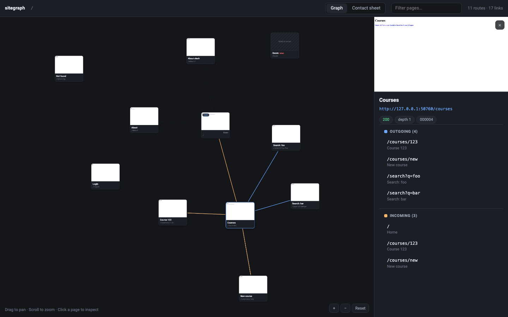
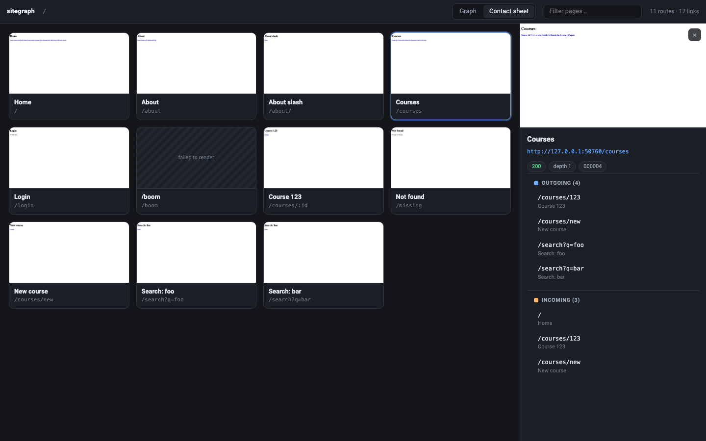

# sitegraph

Crawl a web application, screenshot every page, and explore how the pages
connect, in your browser, in seconds.

```bash
uv run sitegraph crawl http://localhost:3000
uv run sitegraph serve
```

Point it at an app running on your machine and it answers a question that is
tedious to answer by hand: *what pages does this thing actually contain, what do
they look like, and how are they linked?*



## Why

Reading the code tells you which routes exist. It does not tell you which ones
are reachable in practice, what they render, or where a screen actually links.
sitegraph walks the running application the way a person would, following
`<a href>` links and staying on your origin, captures every page it reaches, and
draws the result as a directed graph.

Everything stays on your machine. The crawl writes plain files to a directory,
the explorer is served from that directory, and nothing is uploaded anywhere.

## Requirements

- Python 3.13 or newer
- [uv](https://docs.astral.sh/uv/)
- Chromium, which Playwright downloads for you

## Install

This project is not published to PyPI, and the name `sitegraph` on PyPI belongs
to an unrelated project. Run it from a checkout, and do not `pip install
sitegraph` expecting this tool:

```bash
git clone https://github.com/YOUR-NAME/sitegraph
cd sitegraph
uv sync
uv run playwright install chromium
```

`uv sync` builds the environment. The second command fetches the browser binary
and is the only slow step.

## Quick start

With your app running, crawl it:

```bash
uv run sitegraph crawl http://localhost:3000
```

The crawl is headless, and reports each page as it goes:

```text
[   1/500]  200  /  (Home)
[   2/500]  200  /about  (About)
[   3/500]  200  /about/  (About slash)
[   4/500]  200  /courses  (Courses)
[   5/500]  200  /login  (Login)
[   6/500]  ERR  /boom  Page.goto: net::ERR_EMPTY_RESPONSE at http://localhost:3000/boom
[   7/500]  200  /courses/123  (Course 123)
[   8/500]  404  /missing  (Not found)
[   9/500]  200  /courses/new  (New course)
[  10/500]  200  /search?q=foo  (Search: foo)
[  11/500]  200  /search?q=bar  (Search: bar)

Captured 11 page(s) in 6.8s — 11 in total, 17 edge(s) → .sitegraph
1 page(s) failed to render (kept in the graph).
Nothing is waiting; --resume retries the 1 failed page(s).

Explore with:  sitegraph serve --dir .sitegraph
```

A page that returns 404 is a page like any other and is captured normally. A
page that cannot be rendered at all is kept in the graph and marked failed, so
the link that leads nowhere is visible rather than missing.

Then open the explorer:

```bash
uv run sitegraph serve
```

```text
sitegraph — 11 pages, 17 link(s)
  http://localhost:4777   (local only — Ctrl-C to stop)
```

Two views share one dataset:

- **Graph** — a card per page and an arrow per link. Drag to pan, scroll to
  zoom, drag a card to rearrange the layout. Selecting a page highlights what it
  links to and what links to it, and opens the inspector.
- **Contact sheet** — every page as a grid of thumbnails, for scanning a site
  at a glance.

Zoomed out, a big site is drawn as small marks rather than cards: a few hundred
cards at that size would be a smear, and drawing every screenshot and every
link to make it is slow. Zoom in and the cards, their pictures and the arrows
between them come back. Nothing is hidden — every page keeps its own mark, and
the contact sheet is unchanged.



The inspector shows a page's screenshot, status, depth and ID, and lists its
outgoing links alongside the pages that link to it. Those are clickable, so you
can walk the application from inside the graph. The filter box matches titles
and paths.

## Common tasks

**Leave part of the site alone.** `--skip` is repeatable. A literal pattern
matches whole path segments, so `/admin` does not also swallow `/administrators`:

```bash
uv run sitegraph crawl http://localhost:3000 --skip /admin --skip 're:\.pdf$'
```

**A route has hundreds of near-identical pages.** Draw one card per route
instead of one per row, and cap how many instances are captured:

```bash
uv run sitegraph crawl http://localhost:3000 --per-pattern 1
```

**Look before spending the time.** A dry run walks the site exactly as a real
crawl would, writes nothing, and reports the volume by route:

```bash
uv run sitegraph crawl http://localhost:3000 --dry-run
```

**Make it faster.** Rendering a page is mostly waiting, so the crawl renders
several at once. On a 25-page local site: 15.8s at one worker, 4.7s at four.

```bash
uv run sitegraph crawl http://localhost:3000 --workers 8
```

The default is a few workers for `localhost` and exactly one for anything else,
so a server that is not yours gets a single connection unless you ask for more.

**Capture the whole page, not just the first screen:**

```bash
uv run sitegraph crawl http://localhost:3000 --full-page
```

**Capture a phone layout.** This renders the page at that size, so you get the
site's real responsive layout rather than a shrunken desktop page:

```bash
uv run sitegraph crawl http://localhost:3000 --viewport 390x844
```

**Crawl behind a login.** `login` opens an ordinary browser window and waits
while *you* sign in, SSO and MFA included, then saves the session for `crawl` to
reuse. sitegraph never sees a credential and never fills in a form.

```bash
uv run sitegraph login http://localhost:3000/login
uv run sitegraph crawl http://localhost:3000 --storage-state .sitegraph/session.json
```

Treat the saved file as a credential. It holds live session cookies, which is
enough for anyone holding it to act as that user.

**Finish a crawl you stopped early.** `--max-pages` caps a single run, and with
`--resume` the same command carries on from what is already on disk:

```bash
uv run sitegraph crawl http://localhost:3000 --max-pages 500
uv run sitegraph crawl http://localhost:3000 --max-pages 500 --resume
```

## What it writes

```text
.sitegraph/
├── graph.json          # the whole graph; everything the graph view needs
├── pages/000001.json   # one record per page: status, depth, links
├── screenshots/000001.webp
└── thumbs/000001.webp  # card-sized copies, for the graph view
```

Both JSON files are written as the crawl proceeds, so a run stopped at any
moment, by `--max-pages`, by Ctrl-C, or by a crash, still leaves a dataset that
`serve` can open. Paths inside the data are relative to the output directory, so
a crawl can be moved or served from anywhere. `serve` only ever reads it; it
never writes and it never crawls.

The layout is a stable interface. Read it, script against it, or ignore it.

## What it does not do

Deliberately, for now:

- no form submission, button clicking, or modal discovery;
- no SPA states that are not reachable at a distinct URL;
- no login automation, since `login` hands that to you;
- no visual regression testing or screenshot diffing;
- no SEO, accessibility, or API analysis;
- Chromium only.

A page is defined by its URL, so anything an application renders without
changing the URL is out of reach by design.

This is early software at version 0.1.0, and both the command line and the file
layout may still move between releases.

## Development

```bash
uv run pytest                 # everything, including the browser tests
uv run pytest -m "not e2e"    # unit tests only: fast, and needs no browser
```

The browser tests drive a real Chromium against a real site served in-process,
because the claims worth checking here are about what a browser actually does.

`spec.md` is the design contract, and `CLAUDE.md` records the decisions and the
measurements behind them.

## How this was built

Developed with DeepSeek-v4.1-Flash through the Claude Code CLI, driven from
the T3 desktop app.

## License

Apache License 2.0. See [LICENSE](LICENSE) for the full text.

Copyright 2026 sci2pro.
